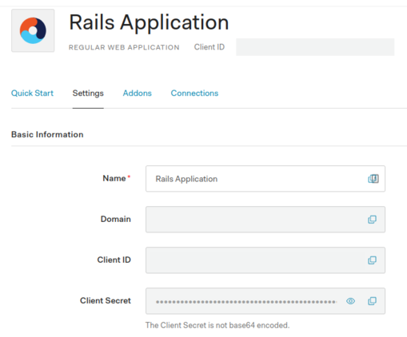

# README

This is a sample Rails 6 project demonstrating authentication with
[auth0](https://auth0.com/). It requires an auth0 account (registration is free)
and depends on a simple
[API project](https://github.com/npetkov/auth0_rails_api_example). Please consult the
readme of that project for backend configuration. Below I'll assume that the API
is served at `http://localhost:3001`.

The frontend content is extremely basic (vanilla javascript and no styles), as I
don't see any need to use an advanced framework/library for the purposes of this
demo/PoC.

The motivation behind this project is to provide a brief, concise introduction
to JWT authentication using Rails. I've read through a lot of resources covering
different aspects of the topic so I decided to put them together in one working
example. The implementation is deliberately kept extremely sparse, as my goal
isn't to present a state-of-the-art architecture but rather to illustrate a
basic OAuth2 code grant flow.

## Installing Ruby and Rails

Please see [this section](https://github.com/npetkov/auth0_rails_api_example#installing-rbenv-and-ruby)
of the API project documentation.
## Installing `nvm` and Node LTS

My preferred method for installing Node versions is via `nvm`. Please refer to
the [documentation](https://github.com/nvm-sh/nvm) for the specific steps
required on your operating system. The examples below illustrate how to install
a particular `nvm` version on Ubuntu:

*  download and run the installer script:

`wget -qO- https://raw.githubusercontent.com/nvm-sh/nvm/v0.37.2/install.sh | bash`

* reload your shell profile:

`source ~/.bashrc`

* install the latest Node LTS version known to `nvm`:

`nvm install --lts`

* check the installed Node version:

``` bash
$ node -v
v14.15.4
```

## Installing `yarn`

According to the [official documentation(https://yarnpkg.com/getting-started/install),
the preferred way to install Yarn 2 is via `npm`:

`npm install -g yarn`

You'll notice that this will install a `1.xx` version of the binary globally;
this is expected.
## Project setup

Clone the repo and run the usual `bundle install`. I'm using ruby 3.0.0 and
can't guarantee that everything will work as expected with earlier versions.

Once all gems have been successfully installed, run `bin/setup`. This will
ensure everything is properly set up, including installing `yarn/npm` packages.

If you run into problems while compiling `node-sass` during the first `yarn`
run, take a closer look at the hints the error messages give away. These issues
are rather common and there are a lot of resources online explaining how to
resolve them.

To launch the server, use `bin/rails s`.

*Side note: node-sass is a @rails/webpacker dependency in the 5.x branch. At the
time of writing, webpacker 6 is still in beta.*
## Auth0 and API secret configuration

The project uses the Rails 6 encrypted credentials scheme. The project relies on
the following credentials being present:

* __auth_domain__

* __auth_client_id__

* __auth_client_secret__

* __api_identifier__

You can find the data for your application/API in the appropriate sections in
the auth0 dashboard. The screenshot below shows the settings page for an
example application. All the values needed can easily be copied over from there.



If you need guidance how to create the needed application and API in auth0,
please consult [this section](https://github.com/npetkov/auth0_rails_api_example#setting-up-an-auth0-application-and-api)
of the API project documentation.

In order to edit the Rails application credentials, run `bin/rails credentials:edit`
in the project root. If Rails complains about an unset `EDITOR` environmental
variable, append one to your shell profile and then source it to apply the
changes:

``` bash
echo 'export EDITOR=vim' >> ~/.bashrc
source ~/.bashrc
```

Please note that the master key used to encrypt the credentials is not under
version control. If you lose it, you'll have to recreate the credentials store.

## Implementation notes - authorization and token retrieval

The projects uses the `omniauth` and `omniauth-auth0` gems, which perform the
[Authorization Code Flow](https://auth0.com/docs/flows/authorization-code-flow)
under the hood. The whole configuration resides in a single initializer and uses
the credentials described in the previous section:

``` ruby
Rails.application.config.middleware.use OmniAuth::Builder do
  provider(
    :auth0,
    Rails.application.credentials.auth_client_id,
    Rails.application.credentials.auth_client_secret,
    Rails.application.credentials.auth_domain,
    callback_path: '/auth/auth0/callback',
    authorize_params: {
      audience: Rails.application.credentials.api_identifier,
      scope: 'openid email profile index:notes create:notes'
    }
  )
end
```

The initializer basically configures the OAuth strategy to request two tokens - an
ID token, containing the openID profile of the user, as well as an access token
for the provided audience (which is the API).

This is the same use case described in [this example](https://auth0.com/docs/scopes/sample-use-cases-scopes-and-claims#authenticate-a-user-and-request-standard-claims-and-custom-api-access):

```
https://YOUR_DOMAIN/authorize?
  response_type=code&
  client_id=YOUR_CLIENT_ID&
  redirect_uri=https://YOUR_APP/callback&
  scope=openid%20profile%20email%20read:appointments&
  audience=YOUR_API_AUDIENCE&
  state=YOUR_STATE_VALUE
```

The OAuth gems take care of generating and verifying the `state` parameter which
is seen in the example request above. After successful authentication, the code
received from auth0 will be [exchanged](https://auth0.com/docs/api/authentication#get-token)
for the tokens which we can access and store in the `callback` action of the
authorization controller:

``` ruby
# In controllers/oauth_controller.rb

def callback
  data = request.env['omniauth.auth']
  session[:id_token] = data['credentials']['id_token']
  session[:api_access_token] = data['credentials']['token']
  redirect_to root_path
end
```

We need to define a mapping between the OAuth callback and our controller action
in `routes.rb`:

```
get  '/auth/:provider/callback', to: 'oauth#callback'
```

This is the same callback path specified in the initializer above, as well as in the
auth0 application configuration, as described [in this
section](https://github.com/npetkov/auth0_rails_api_example#creating-a-new-application).

The implementation of the OAuth controller follows the [sample Rails
implementation](https://auth0.com/docs/quickstart/webapp/rails) on the Auth0
site with some minor adaptations. Please note that both tokens are stored in the
session, which is not optimal as they can rapidly grow in size when defining new
API permissions, for example.

One area that isn't covered in the implementation is token refresh.

## Implementation notes - frontend

Once the user has been authenticated, the "frontend" application will load
and perform a POST request to `/api_params`, retrieving the address
and the access token for the API.

The API access token is kept in-memory as it can be easily retrieved from the
backend if needed (on page reload, for example).

The frontend implementation is deliberately kept very sparse (no stylesheets
etc.) as the focus of the project is on the authentication/authorization flow.
## Testing

I haven't implemented any tests yet so please feel free to contribute.

## Contributing

Don't hesitate to create issues or feature requests. Any suggestions are welcome.
## Disclaimer

I am not part of the auth0 team nor am I affiliated to auth0 in any way. I'm using auth0 for the sole purpose of
demonstrating a basic OAuth2 code grant flow.

## License

This product is licensed under the [MIT License](https://github.com/npetkov/auth0_rails_frontend_example/blob/dev/LICENSE).
